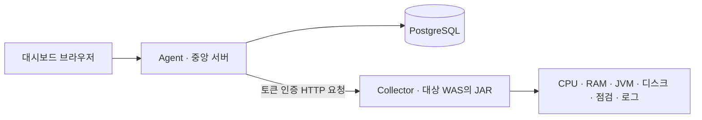

# 구조

Agent는 대시보드와 중앙 수집 서버이고, Collector는 대상 WAS에 설치하는 Java 7 호환 JAR입니다. Agent의 Java 패키지는 `com.monitoring.agent`, Collector는 `com.monitoring.collector`입니다.

Collector의 `/monitor/v1` API를 Agent가 인스턴스별 설정 주기에 따라 호출하고 PostgreSQL에 최신값과 이력을 저장합니다. 브라우저는 Collector에 직접 접속하지 않습니다. 실시간 로그 본문은 DB에 저장하지 않습니다.

식별자는 `project_id → instance_id` 두 단계뿐입니다. Agent는 Collector URL을 요청마다 한 번만 DNS resolve하고 모든 answer가 허용 정책을 만족하면 그 검증된 IP로 직접 연결합니다. HTTP `Host`와 HTTPS hostname verification/SNI에는 원래 hostname을 사용하며 redirect와 1MB 초과 응답을 거부합니다. metadata/link-local/any-local/multicast는 항상 차단하고 loopback은 IPv4 `/32` 또는 IPv6 `/128`로 정확히 허용해야 합니다. 토큰은 AES-256-GCM으로 저장합니다.

인증서 즉시 검사는 bounded executor에 접수한 뒤 HTTP 202를 반환합니다. scheduler는 기본 60초마다 due target을 찾고 target별 `check_interval_minutes`(기본 360분)를 적용합니다. 성공 latest에는 leaf serial과 전체 validity window, chain/hostname 검증 및 상태를 저장하고 실패 latest에는 인증서 값 대신 NULL과 `DOWN`을 저장합니다.
